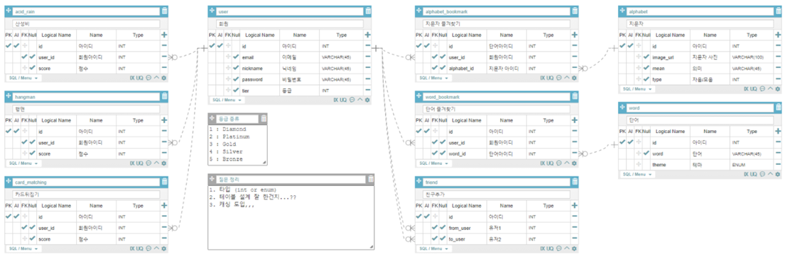

# Aksoo(악수 프로젝트)

지문자를 쉽고, 재밌고, 즐겁게 배우고 싶은 모든 분들을 위한 서비스, '악수'입니다.


## Service Target

- 후천적 청각장애로 인해 수화를 배워야하지만 수화가 어려워 지문자를 먼저 배워야 하는 사람
- 지문자를 배우고 싶은데 단순히 배우는 것에 싫증이 나서 색다른 방법으로 배우고 싶은 사람
- 게임에서 선의의 경쟁을 통해 1위를 해보고 싶은 사람

</br>

## 🏛 Service Architecture

</br>

</br>

## 💾 DB modeling

</br>



</br>

## 🎮 Tech Stack

</br>

### 💻Back-End

#### 프레임워크

- Django - 3.2.5
- djangorestframework(DRF) - 3.12.4

#### 라이브러리

- djangorestframework-simplejwt - 4.8.0
- dj-rest-auth - 2.1.11
- PyMySql - 1.0.2
- 이외의 자세한 라이브러리는 [requirements.txt](./Back/django-game/requirements.txt) 참조

</br>

### ✨Front-End

#### 프레임워크

- Vue.js - 2.6.14

#### 라이브러리

- axios - 0.21.1
- vuex - 3.6.2
- vue-router - 3.5.2
- 이외의 자세한 라이브러리는 [package.json](./Front/client/package.json) 참조

</br>

### 👾 Machine Learning

#### 프레임워크

- TensorFlow.js - 3.9.0

#### 라이브러리(모델)

- [fingerpose](https://github.com/andypotato/fingerpose#readme) - 0.0.2
- [tensorflow-models/handpose](https://github.com/tensorflow/tfjs-models#readme) - 0.0.7

</br>

## ⚙️ Install and Usage

</br>

### 🔨 Usage

#### 프로젝트 구성도

```
📁 Front				# 프론트 
📁 Back					# 백엔드 
📁 AI					# 인공지능
```

</br>

### 프로젝트 시작하기(Local 기준)

> 각 폴더 별로 실행 시켜야 합니다.

#### Back-End

##### 1) Back/django-game/ 으로 이동한다.

##### 2) 터미널창을 열어 다음과 같이 입력하여 가상환경을 만든다.

```bash
python -m venv venv
```

##### 3) 다음과 같이 입력하여 가상환경을 킨다.

```bash
source venv/Scripts/activate
```

##### 4) (처음 실행시에만) 다음과 같이 입력하여 필요한 package를 현재 가상환경에서 설치한다.

```bash
pip install -r requirements.txt
```

##### 5) Django 서버를 킨다.

```bash
python manage.py runserver
```

</br>

#### Front-end

##### 1) .env.local 파일을 Front/client/ 경로에 만든다.

##### 2) .env.local을 열어 아래 내용을 붙여넣는다.(기본으로 켜질 로컬호스트 주소)

```
VUE_APP_SERVER_URL = http://127.0.0.1:8000
```

##### 3) Front/client/ 경로에서 터미널창을 킨다.

##### 4) (처음 실행시에만) 다음과 같이 package를 설치한다.

```bash
npm install
```

##### 5) 다음과 같이 클라이언트를 로컬 환경에서 실행한다.

```bash
npm run serve
```

</br>

## 📚WIKI
👉[B306팀의 협업방법 보러가기](https://github.com/zmd9220/Aksoo/wiki)👈

👉[프로젝트 소개](./악수_소개.pdf)👈

